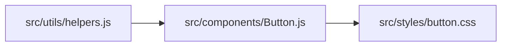

## Description
A Python tool for generating Mermaid.js dependency diagrams from a TypeScript/JavaScript project. It scans your codebase, identifies import dependencies, and provides a clear visualization of project structure.

## Requirements
- Python 3.12+
- Mermaid compatible viewer/editor (https://mermaid.live/, for example)

## Usage

```bash
python main.py /path/to/your/project > diagram.md
```

Then open `diagram.md` in a Mermaid viewer/editor to visualize your dependency graph.

## Example Output


## License
MIT
